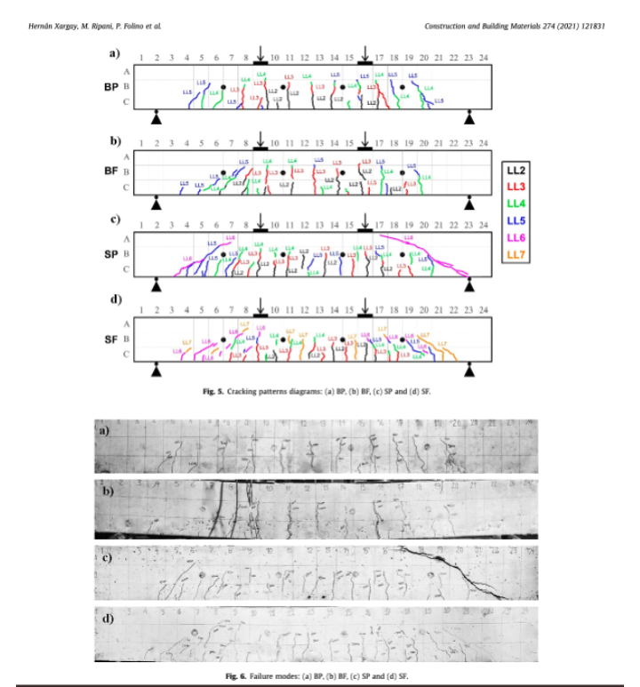

# Unsupervised Machine Learning Analysis for AE Parameters in Reinforced Concrete Beams

## Overview

This repository contains the implementation of an unsupervised machine learning analysis using DBSCAN to study the Acoustic Emission (AE) parameters in reinforced concrete (RC) beams. The dataset corresponds to experimental data obtained from real-scale RC beams subjected to cyclic loading tests. The work analyzes AE parameters and clusters them to detect patterns related to crack propagation and structural damage.

The experiments analyzed in this project are based on the paper:

**"Acoustic emission and damage evolution in steel fiber-reinforced concrete beams under cyclic loading"** by Hernán Xargay, Marianela Ripani, Paula Folino et al., published in *Construction and Building Materials* 274 (2021).



## Features

- **Data Preprocessing:** Filters relevant columns (e.g., RISE to ABS-ENERGY) while excluding irrelevant ones like `CH` and `THR`.
- **DBSCAN Clustering:** Implements DBSCAN for each load level to identify clusters of AE events.
- **Statistical Analysis:** Generates descriptive statistics (mean, std, median, min, max) for AE parameters by cluster and compares clusters across load levels.
- **Cluster Similarity Analysis:** Evaluates whether clusters from different load levels have similar AE parameter statistics.
- **Visualization:** Provides tools to visualize the clustering process and elbow plots to determine DBSCAN parameters (e.g., `eps`).

## Experimental Setup

The experiments simulate the behavior of RC beams subjected to cyclic loading up to failure. AE monitoring data includes parameters such as Signal Strength, Energy, and Rise Time, which are analyzed in the clustering process.

### Key Experimental Details:

- **Beams:** Real-scale RC beams with varying reinforcement configurations and fiber content.
- **Sensors:** R15-I resonant AE sensors with a peak frequency of 150 kHz.
- **Loading:** Cyclic loading in incremental steps until structural failure.
- **Analysis Indices:** AE indices such as Load Ratio (LR), Calm Ratio (CR), and Cumulative Signal Strength Ratio (CSSR) are derived and analyzed.

## Installation

1. Clone the repository:
   ```bash
   git clone https://github.com/username/repository-name.git
   cd repository-name
   ```
2. Install dependencies:
   ```bash
   pip install -r requirements.txt
   ```

## Usage

1. Place the dataset (e.g., Excel file) in the `data/` directory.
2. Run the analysis script:
   ```bash
   python UnsupervisedMLAnalysis_BP_DBSCAN.py
   ```
3. Outputs will be saved in the `results/` directory, including:
   - Cluster assignments per load level.
   - Descriptive statistics for each cluster.
   - A comparative analysis Excel file summarizing clusters across load levels.

## Results

The results include:

1. Identification of clusters with similar AE parameters across load levels.
2. Statistical summaries (mean, std, etc.) for AE parameters in each cluster.
3. Insights into the progression of structural damage as a function of load.

## References

1. Hernán Xargay, Marianela Ripani, Paula Folino, et al. *"Acoustic emission and damage evolution in steel fiber-reinforced concrete beams under cyclic loading"*. Construction and Building Materials, 2021. [DOI link](https://doi.org/10.1016/j.conbuildmat.2020.121831).

---

For more details, check the documentation or contact the repository maintainer.

